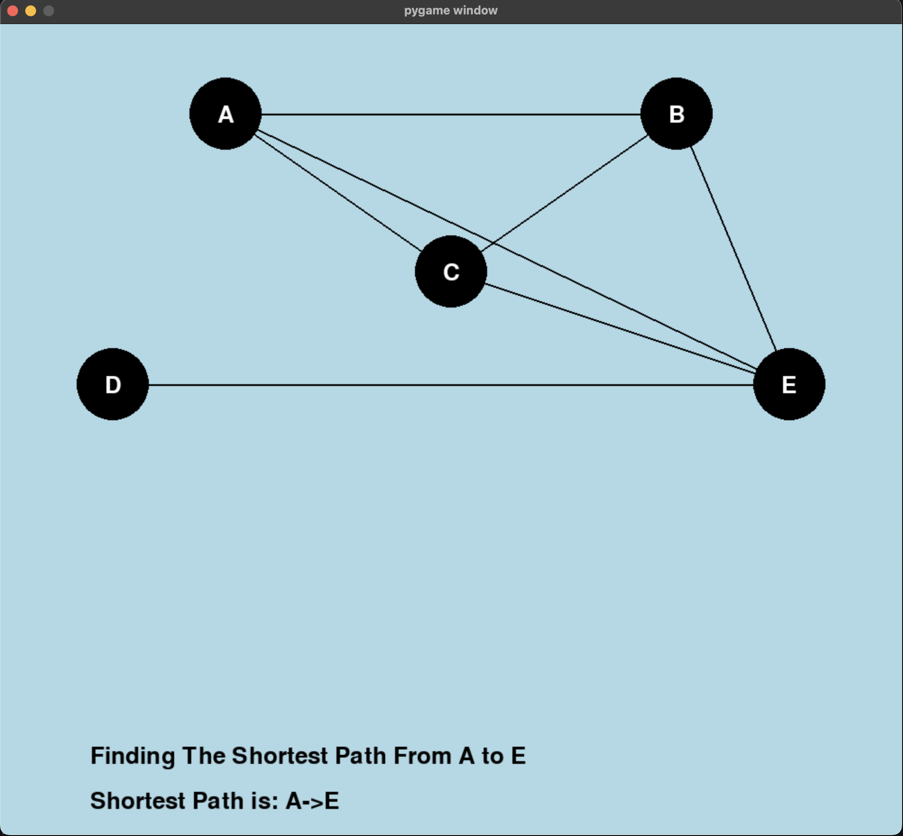
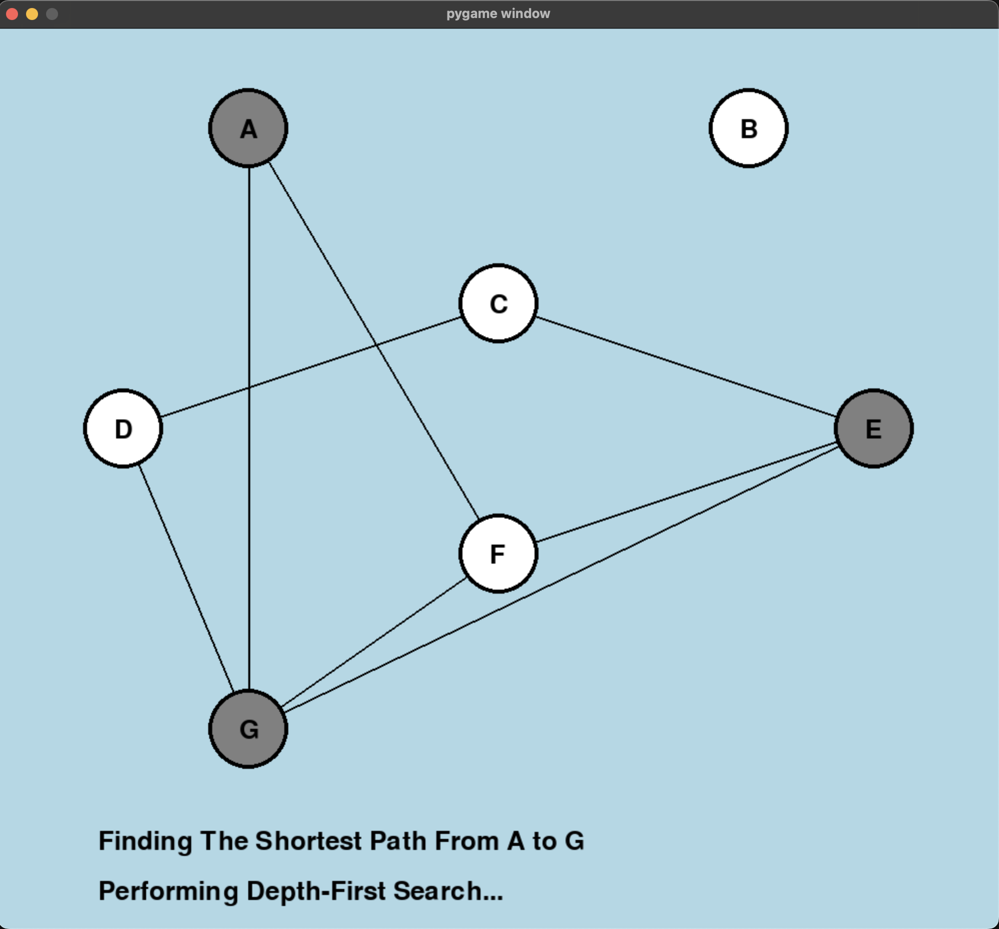

# Graph Traversals
A project that illustrates 3 different types of un-directed graph traversals: Breadth-First Search, Depth-First Search, and BiDirectional Search.

## Graphics and Functionality
The graphic representation of each search is demonstrated using pygame, one of Python's built-in libraries.
There is random generation of nodes, ranging from 3 to 8, which make up an undirected graph.

There is also a random generation of edges, which gives us a variety of graph structures, including disconnected components and a fully connected graph.

Nodes can be one of three colors:
-<i>WHITE:</i> Undiscovered at the current step in traversal.
-<i>GREY:</i> Currently exploring the edges of this node.
-<i>BLACK:</i> All edges of this node have been fully discovered.

The graphic representation is an animation of all three traversal methods; however, it is slowed because, otherwise, we wouldn't be able to follow along.
The order is as follows:
1. Breadth-First Search
2. Depth-First Search
3. Bi-Directional Search
After each traversal has completed, the shortest path from the start node to the destination node is printed at the bottom of the graph.

## In-Action

<i>Image in the beginning of a breadth first search, with a few nodes in progress of being explored, and many yet to be discovered.</i>

<i>Image at the end of depth first search, with the current shortest path displayed on the bottom and all nodes fully explored</i>